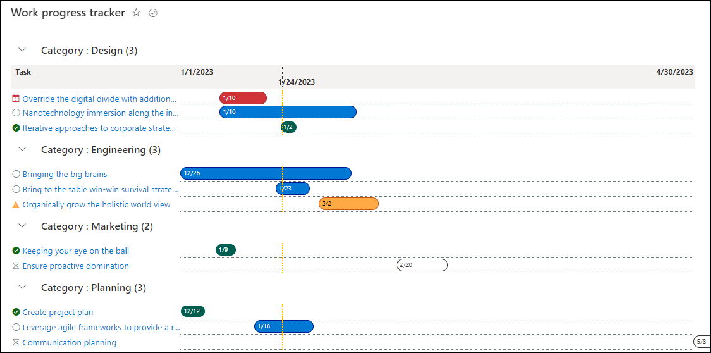

# Work Plan Tracker Gantt Chart

## Summary
This sample demonstrates how to show a list of tasks in a view similar to a gantt chart. This is a modification to the [project-gantt-chart.json](https://github.com/pnp/List-Formatting/tree/master/view-samples/project-gantt-chart) contributed by [Geert de Kooter](https://github.com/gdk-max) ([@gdekooter](https://twitter.com/gdekooter)). The goal of this formatting was to satisfy the user's request to have a nice looking gantt chart and make the steps easy to reproduce:
- Start with the OOTB Work Progress Tracker list template and add two calculated columns to support the gantt chart date range.  *Read the additional notes if you don't want to add the additional columns*   
- Use a calculated column for the date range instead of manually filling in the dates for each row.  *Most samples use regular date fields and require updating all rows with matching information*   
- Use a floating date range based on today's date. Show me a gantt chart with a ranged that is 15 days in the past and 60 days in the future. Everything outside the date range can be condensed to the far left or far right. *The samples I found broke pretty bad if the task start/end dates were outside the project start/end dates.*   
- Rows are more condensed so you can fit more on the screen. The bubbles include the start date of the task. Hover the mouse over the bubble and it shows the category, task name, start and end dates.   
- Colors for the bubbles and icons are based on the progress status.   
- The Fluent Icons are based on the progress status.   
- Allow grouping to the view so that a long list can be condensed.

A list with basic columns

  

Can display in a visual summary gantt chart, including preferred sort orders.

  

And if you add grouping to your list view settings and then apply the formatting, it can look like this.

  

## View requirements
This format uses the following columns to be part of the view:

|Type|Internal Name|Required|Notes|
|---|---|:---:|:---:|
|Single line of text|Title|Yes|
|Date|StartDate|Yes|
|Date|DueDate|Yes|
|Choice|Progress|Yes|For this sample use the following values `Not Started` `In Progress` `Blocked` `Behind` `Completed`
|Choice|Category|No|Used in the hover text but not required.
|Calculated Date|GanttChartStart|Yes|This determines the start of the date range for the gantt chart view. Example: `="01/01/2023 0:0:00 AM"` Example of 15 days in the past: `=Today()-15`
|Calculated Date|GanttChartEnd|Yes|This determines the end of the date range for the gantt chart view. Example: `="04/30/2023 0:0:00 AM"` Example of 60 days in the future: `=Today()+60`

## Additional notes

### Hard coding a date range
In case you don't want to add the additional date columns. Or maybe you want a custom view that shows a limited set of item and a shorter date range. You can use Find/Replace and swap out the text `('[$GanttChartStart]')` and `('[$GanttChartEnd]')` with a hard coded date formatted like `('2022-10-27T06:00:00Z')`

### Grouping the view is not displaying the date range on top
When you apply grouping to the view, it may not display the date range on top. This is due to the formatting and will only display on the first row of the list. Expanding the first group should show the date range again.

## Sample

Solution|Author(s)
--------|---------
gantt-chart-work-progress-tracker.json | [Pete Behler](https://github.com/PeterBehler) ([@PeteFromDenver](https://twitter.com/PeteFromDenver))

## Version history

Version|Date|Comments
-------|----|--------
1.0|January 24, 2023|Initial release

## Disclaimer
**THIS CODE IS PROVIDED *AS IS* WITHOUT WARRANTY OF ANY KIND, EITHER EXPRESS OR IMPLIED, INCLUDING ANY IMPLIED WARRANTIES OF FITNESS FOR A PARTICULAR PURPOSE, MERCHANTABILITY, OR NON-INFRINGEMENT.**

---

