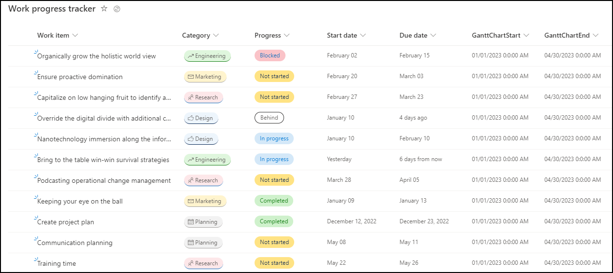
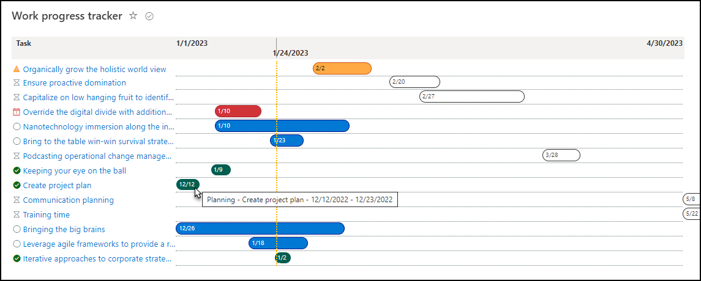
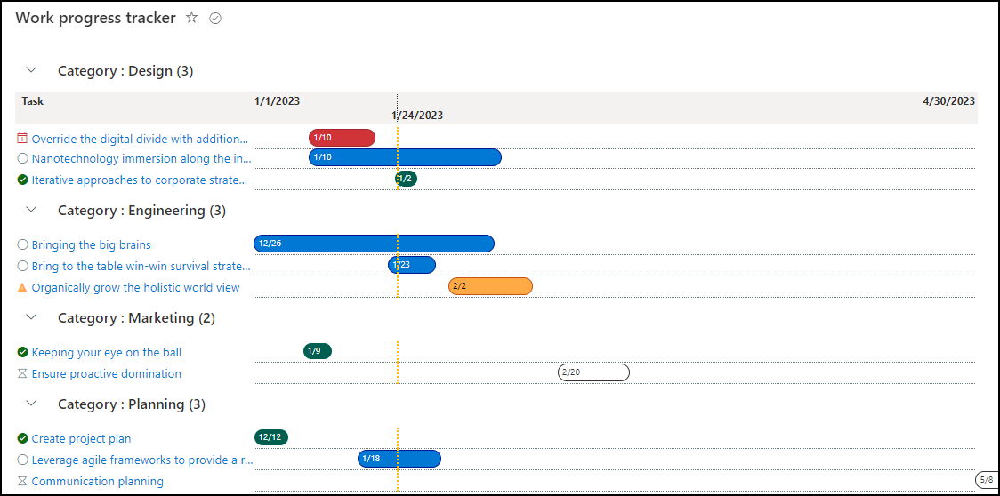

# Work Progress Tracker Gantt Chart

## Summary
This sample demonstrates how to show a list of tasks in a view similar to a gantt chart. This is a modification to the [project-gantt-chart.json](https://github.com/pnp/List-Formatting/tree/master/view-samples/project-gantt-chart) contributed by [Geert de Kooter](https://github.com/gdk-max) ([@gdekooter](https://twitter.com/gdekooter)). The goal of this formatting was to show 100's of tasks in a gantt chart and make the steps easy to reproduce:
- Rows are more condensed so you can fit more on the screen. The bubbles include the start date of the task. Hover the mouse over the bubble and it shows the category, task name, start and end dates.   
- Colors for the task bubbles and icons are based on the progress status.   
- The Fluent Icons are based on the progress status.   
- Allows grouping in the view so that a long list can be collapsed.   
- Start with the OOTB Work Progress Tracker list template, or custom lists with tasks start and end dates. Then add two date columns to support the gantt chart date range and adjust the progress choices if needed.   
- Use a calculated column for the date range if you don't want to manually populate the dates for each row. The allows you to provide static dates or formulas for the date range. *These instructions are based on all tasks having the same date values.*   
-The gantt chart date range can be the whole project or just a portion. Tasks that are scheduled outside the date range will be condensed to the far left or far right of the chart. *The samples I found broke pretty bad if the task start/end dates were outside the project start/end dates.*   

A list view with required columns and progress choices, preferred sort order, and filters applied.

  

Paste the JSON to the Advanced List Formatting.
- Left side icons and colors are based on Progress column choices.
- Task bubbles are colored based on Progress column choices.
- If progress values don't match the JSON code, they will appear white/black.
- Hovering the cursor over the task bubble will show the Category, Title, and task Start/End dates. If you do not include Category in the view, the hover text will adapt.
- When a task end date is earlier than the gantt chart date range, it will compressed to the far left.
- When a task start date is greater than the gantt chart date range, it will compressed to the far right. *I tried to have it right justified so that it doesn't appear to go off the screen but couldn't make it happen*

  

If you add grouping to your list view settings and then apply the formatting, it can look like this.

  

## View requirements
This format uses the following columns to be part of the view:

|Type|Internal Name|Required|Notes|
|---|---|:---:|:---:|
|Single line of text|Title|Yes|
|Date|StartDate|Yes|
|Date|DueDate|Yes|
|Choice|Progress|Yes|This sample uses the following values `Not Started` `In Progress` `Blocked` `Behind` `Completed`
|Choice|Category|No|Used in the hover text but not required.
|Calculated Date|GanttChartStart|Yes|This determines the start of the date range for the gantt chart view. Example: `="01/01/2023 0:0:00 AM"` Example of 15 days in the past: `=Today()-15`
|Calculated Date|GanttChartEnd|Yes|This determines the end of the date range for the gantt chart view. Example: `="04/30/2023 0:0:00 AM"` Example of 60 days in the future: `=Today()+60`

## Additional notes

### Hard coding a date range
In case you don't want to add the additional date columns. Or maybe you want a custom view that shows a limited set of item and a shorter date range. You can use Find/Replace and swap out the text `([$GanttChartStart])` and `([$GanttChartEnd])` with a hard coded date formatted like `('2022-10-27T06:00:00Z')`

### When you use Grouping, it may not display the date range on top
This is because JSON is adding the time line to the 1st row. If the first row is compressed, it will be hidden. Expanding the first group should show the date range again. 

### Using filters and task summary to make a project overview
I've had people use the Category column or something else to classify a row as a Task or Task Summary. Then set up custom views to filter rows that identify as a Task Summary so that it displays less rows for project overviews. Then the task list gantt chart would filter to only so when Categoy is not Task Summary. Using filters for task dates and status will also for the display to appear more managable or targeted for specific teams.

## Sample

Solution|Author(s)
--------|---------
workprogress-gantt-chart.json | [Pete Behler](https://github.com/PeterBehler) ([@PeteFromDenver](https://twitter.com/PeteFromDenver))

## Version history

Version|Date|Comments
-------|----|--------
1.0|January 26, 2023|Initial release

## Disclaimer
**THIS CODE IS PROVIDED *AS IS* WITHOUT WARRANTY OF ANY KIND, EITHER EXPRESS OR IMPLIED, INCLUDING ANY IMPLIED WARRANTIES OF FITNESS FOR A PARTICULAR PURPOSE, MERCHANTABILITY, OR NON-INFRINGEMENT.**

---

